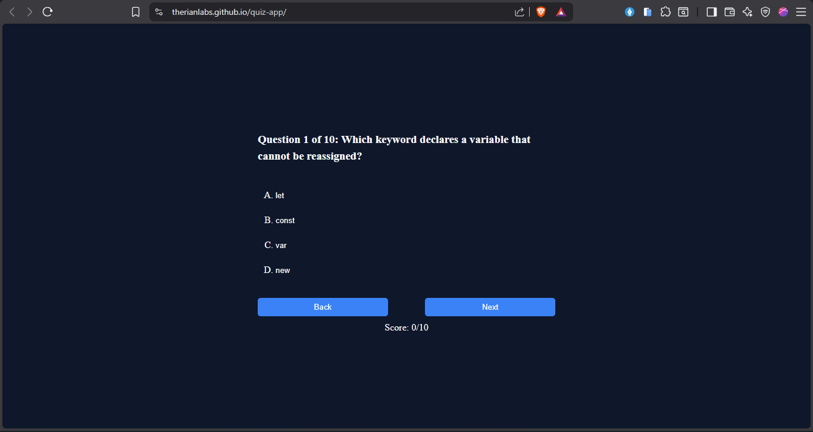

# 🧠 JavaScript Quiz App

A simple quiz application built with HTML, CSS, and JavaScript. Users answer multiple-choice questions, receive instant feedback, and see their final score at the end of the quiz.

## 🚀 Live Demo

https://therianlabs.github.io/quiz-app/

## 📸 Screenshot

## ✨ Features

- Multiple-choice questions
- Instant feedback (Correct/Wrong)
- Score tracking
- Final score screen
- Restart quiz option
- Responsive design for desktop and mobile

## 🛠️ Technologies Used

- HTML5
- CSS3
- JavaScript (ES6)

## 📚 What I Learned

This project helped me practice:

- DOM manipulation
- Event listeners
- Arrays and objects
- Loops
- Functions
- Conditional statements
- Responsive design
- Deploying a project with GitHub Pages

## 🔮 Future Improvements

- Difficulty levels (Easy, Medium, Hard)
- Randomized questions
- Progress bar
- Timer for each question
- High score using localStorage
- Fix the score duplication bug when revisiting questions

## 👨‍💻 Author

**Christian Aniekwe**

I'm a frontend developer in progress, documenting my learning journey and building projects in public.

### 🤝 Connect With Me

- **X:** https://x.com/0xHol_mar
- **GitHub:** https://github.com/TherianLabs

If you have feedback, suggestions, or just want to connect, feel free to reach out!
